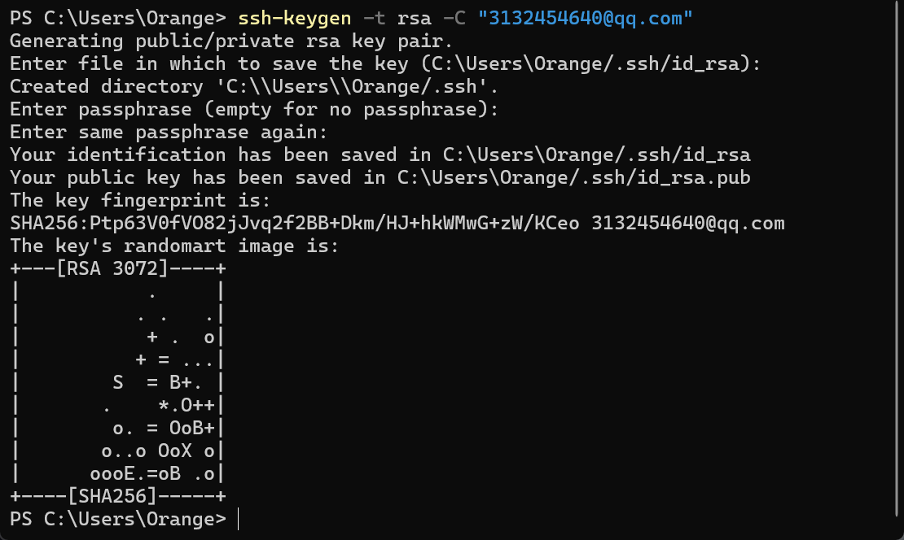
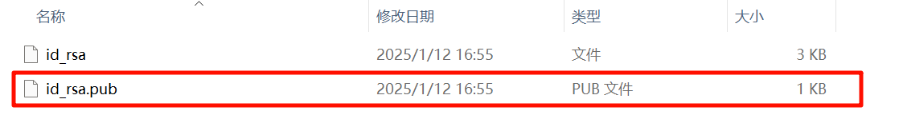
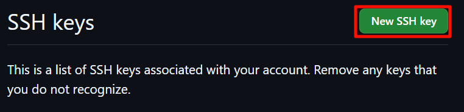

## 本地创建SSH密钥

若没生成过SSH密钥，输入下列命令生成SSH文件夹：

```
ssh-keygen -t rsa -C "your email"
```



得到如图所示即创建成功。

## 将本地SSH密钥关联到Github账户

创建SSH成功后，打开 C\user\你的用户\.ssh 文件夹，将id_rsa.pub文件打开，复制；



接着打开Github账户，将SSH密钥粘贴到对应位置即可：



至此，SSH关联完成！
## Git初步配置

打开Powershell或git bash，输入下列命令：

```
$ git config --global user.name "your github name"
$ git config --global user.email "your github email"
```

配置成功！

## Git上传步骤

进入你需要上传的文件夹，打开Git Bash：

```
git init
git add .   # 将文件挂载
git commit -m "first commit"   # 上传到暂存区
git branch -M main
git remote add origin https://github/**
git push -u origin main
```

上传成功！