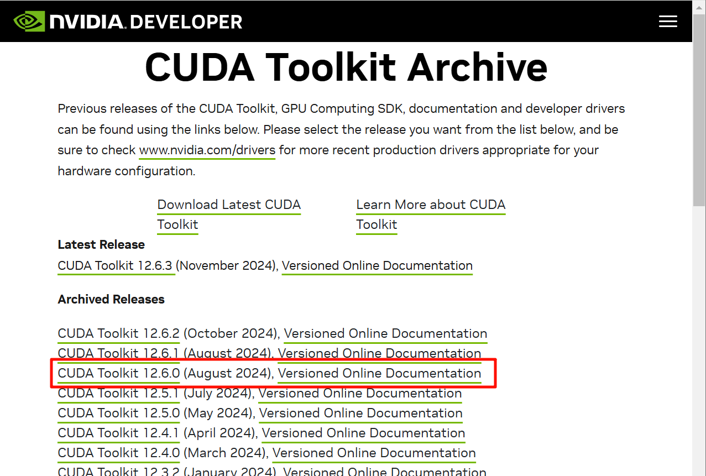
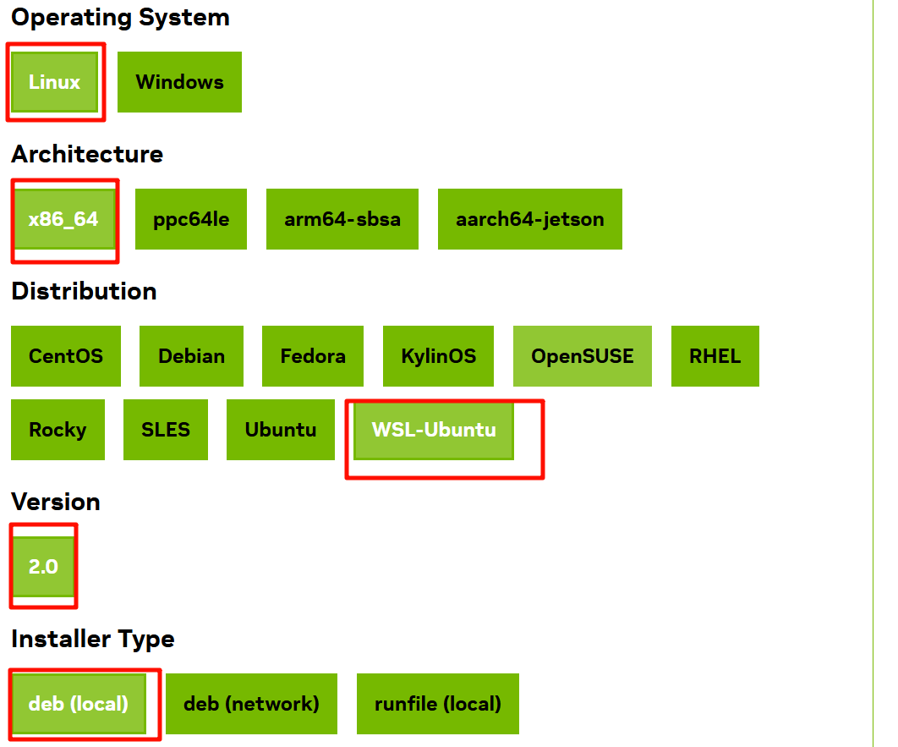
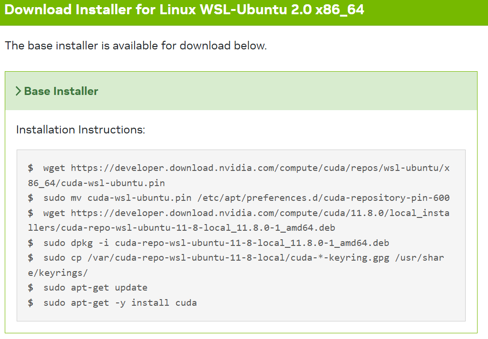
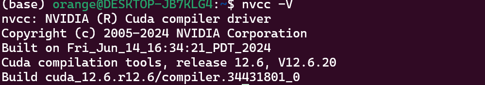
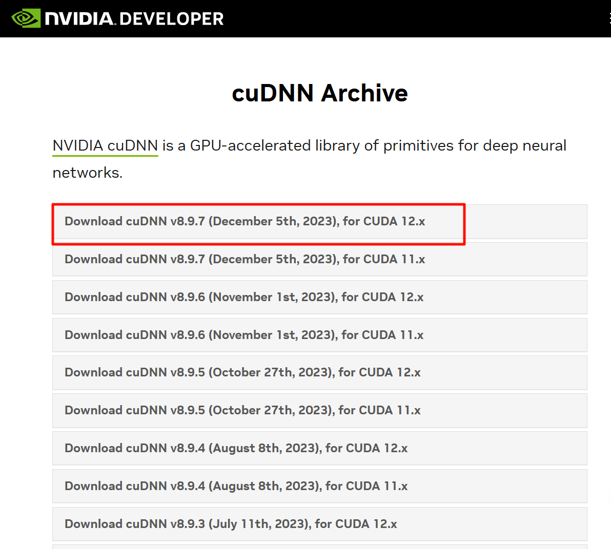
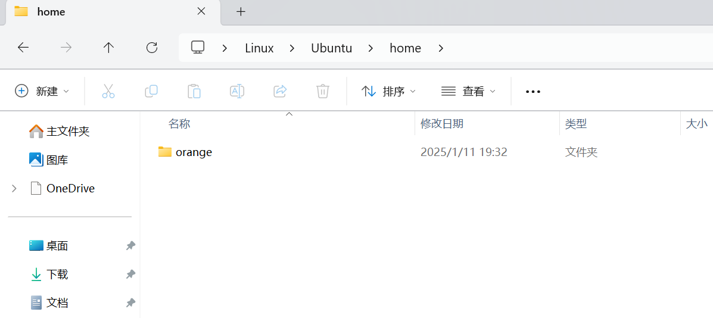
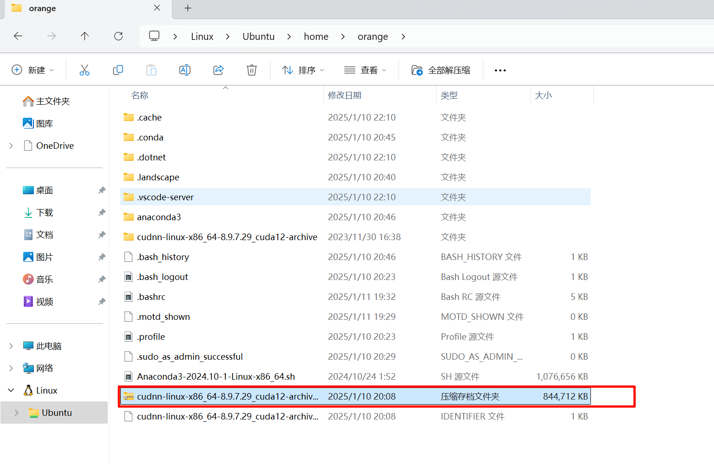
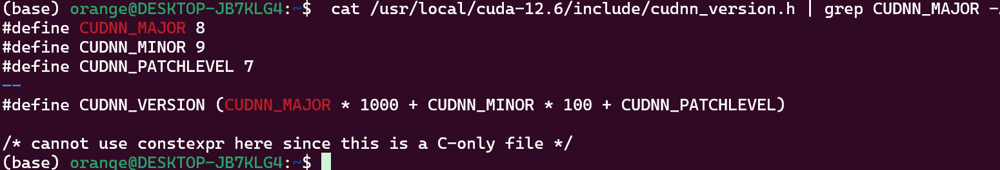
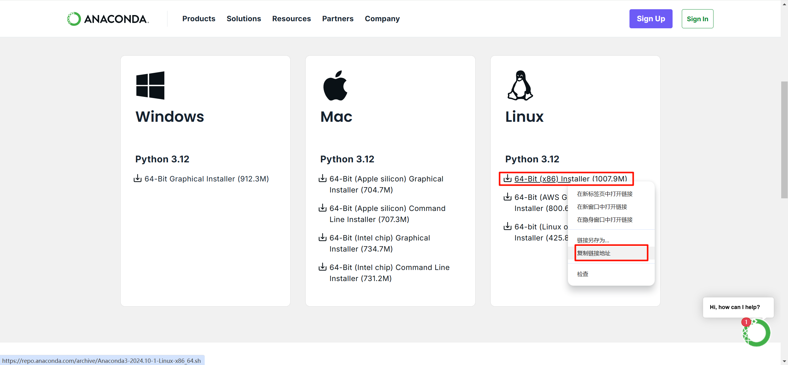

# Why? 为什么我们需要WSL

WSL是安装在Windows下面的子系统，对于深度学习而言，使用Linux训练模型的速度优于Windows，因此我们可以在Windows系统中配置出一个子系统，即WSL。

# 安装Wsl
## Step1：安装WSL
在管理员模式下打开PowerShell，输入：

```
wsl --install
```

即可安装WSL，然后重启计算机。

**Tips:**

如果你希望安装旧版的WSL，你可以参考[Microsoft WSL安装教程](https://learn.microsoft.com/zh-cn/windows/wsl/install)

## Step2：配置Cuda

### 1. 安装cudatoolkit

首先，直接去[官网]([https://developer.nvidia.com/cuda-toolkit-archive](https://developer.nvidia.com/cuda-toolkit-archive))下载你所需要的版本  


这里我选择的是12.6.0的版本。然后选择wsl版本安装：

  
将这几条命令挨个输入进wsl终端中即可：  

  

### 2. 配置cuda环境变量  

在wsl终端中输入以下命令：

```
sudo nano ~/. bashrc
```

然后在打开的文件中添加以下内容：

```
export PATH=/usr/local/cuda-11.8/bin${PATH:+:${PATH}}
export LD_LIBRARY_PATH=/usr/local/cuda-11.8/lib64${LD_LIBRARY_PATH:+:${LD_LIBRARY_PATH}}
```

接着我们按Ctrl+x进行保存并退出，更新环境变量：

```
source ~/. bashrc
```

此时当我们执行 "nvcc -V" 这样便可以显示cuda版本：



当显示出这些版本信息的时候你这一步的配置就成功了。

### 3. 安装cudnn

首先我们需要千万[cuDNN官网](https://developer.nvidia.com/rdp/cudnn-archive)下载对应版本的cuDNN，由于我前一步下载的是12.6.0版本的cudatoolkit，那么这里我就下载12.x的版本：

   

这一步操作之后我们会得到一个压缩包，接下来我们先不用解压，直接把这个压缩包复制到wsl的home文件夹下其中一个用户的文件夹里，例如我们home文件夹中有一个名为orange的用户，我们打开该文件夹并把压缩包复制到这个文件夹下：

|  |  |
| ----------------- | ----------------- |

复制成功之后，打开wsl的终端，进入home里面的用户文件夹目录，输入命令解压该文件夹（后面是你的压缩包名称）：

```
 sudo tar -xvf cudnn-linux-x86_64-8.9.7.29_cuda12-archive.tar.xz
```

然后输入下列命令将解压得到的文件拷贝进对应的文件夹内部：

```
# 以下是安装命令     
sudo cp -r /lib/* /usr/local/cuda-12.6（自己检查具体的版本修改路径）/lib64/
sudo cp -r /include/* /usr/local/cuda-12.6（自己检查具体的版本修改路径）/include/

# 为更改读取权限：
sudo chmod a+r /usr/local/cuda-12.6（自己检查具体的版本修改路径）/include/cudnn*
sudo chmod a+r /usr/local/cuda-12.6（自己检查具体的版本修改路径）/lib64/libcudnn*
```

### 4. 检查cudnn是否安装成功

```
 cat /usr/local/cuda-12.6（自己检查具体的版本修改路径）/include/cudnn_version.h | grep CUDNN_MAJOR -A 2
```

如出现下列字样即安装成功：




## Step3：安装Anaconda

在[Anaconda官方链接](https://www.anaconda.com/download)中下载Linux版本的Anaconda：



回到Linux的终端，输入：

```
wget https://** (你刚刚复制得到的链接)
```

之后执行：

```
sh A** (按下tab键自动补齐)
```

接着按照出现的提示按Enter或者Yes即可完成安装。

到这一步conda已经成功安装到wsl中了，接下来关于环境的配置不展开叙述。